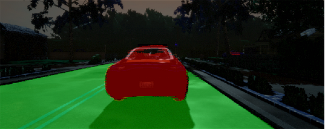

# SemanticSegmentation for self driving cars
## Road and cars segmentation
Thesis for Udacity machine learning engineer nanodegree

## ENet model modified for high speed semantic segmentation
93.99% accuracy and 189 FPS using an old NVIDIA GTX 1050Ti on 320x800 pixels images

## Dataset
[Dataset](https://www.kaggle.com/kumaresanmanickavelu/lyft-udacity-challenge/home)

## Minimum hardware requirements
  - 16 Gb RAM
  - NVIDIA GTX 1050Ti

## Requirements
  - numpy=1.16.0
  - matplotlib=3.0.2
  - pandas=0.23.4
  - opencv-contrib-python=4.0.0.21
  - scipy=1.2.0
  - scikit-learn=0.20.2
  - tensorflow-gpu=1.12.0

## Check my report here
[Report](Report.pdf)
